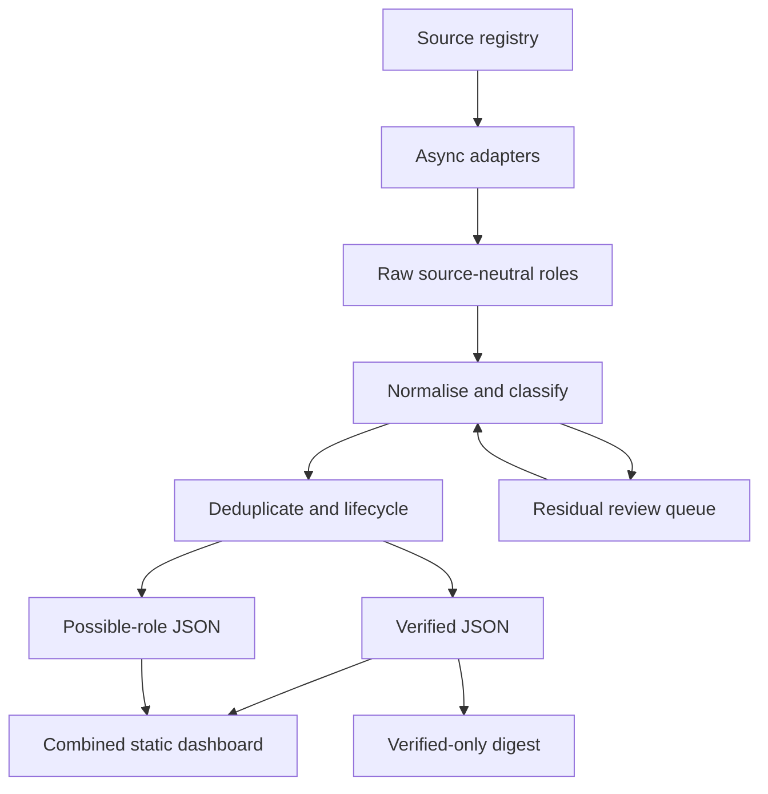

# Architecture

## Data flow

Adapters retrieve public source bytes with bounded concurrency, timeouts, retry/backoff, a descriptive user agent and robots checks. Retrieval and parsing failures return source-health records instead of terminating the run. Parsers emit `RawRole`; they do not make policy decisions.

Classification normalises locations/cycles, assigns a primary category and tags, evaluates eligibility, evaluates relevance separately, records exact evidence and creates an explainable component score. Deduplication and closure logic operate on validated `RoleRecord` objects. JSON storage writes atomically and skips byte-identical updates.

## Adapters and authority

The adapter registry covers Greenhouse, Lever, Ashby, SmartRecruiters, Workday, Teamtailor, generic JSON, RSS/Atom, monitored HTML, government portals, W4MP, Higherin, CharityJob, NHS Jobs, jobs.ac.uk, targetjobs, DWP Work Hub, Prospects, Legal Cheek, Adzuna and Reed search services, trusted boards and curated YAML. Large public-board adapters are rate limited, validate pagination or query-shard coverage and run on a six- or twelve-hour scheduled cadence. Authority descends from official ATS/programme/government sources through official careers pages and approved trusted boards to discovery-only sources. Discovery-only evidence can create only a possible-role record.

Employer/source configuration owns endpoints and rate limits. Unsupported proprietary platforms remain disabled until an employer-specific adapter or safe official-page monitor is tested. No adapter crosses authentication, CAPTCHA or other technical controls.

## Review queue and state

Verified, possible, closed and residual-review records are persisted separately. Rules are reapplied to both possible and review records, so a newly allowed internship can be promoted without waiting for its source to run again. The diagnostic review queue retains only non-cycle-unstated programme candidates and is capped at 500 records. Possible-role replacement is source-aware: a failed, capped or structurally changed source cannot erase records that were not returned, while a record that was fetched and now fails the publication filter is removed immediately. Manual overrides require role ID, dated decision, reason and official evidence URL. Digest state records successful runs and previously sent verified role IDs. Observations preserve source ID, external identifier, URL and observation time.

## Dashboard

Python generates semantic HTML, inline CSS and minimal JavaScript into `site/generated`. No server or browser secret is required. Search/filter/sort operates locally across verified and possible table rows, as does the `localStorage` saved-role set. JavaScript exposes at most 100 matching rows at a time and loads the selected escaped card from `role-details.json` on demand, avoiding hundreds of duplicate full cards in the initial DOM. `roles.json` excludes uncertain/ineligible records; `possible-roles.json` may contain uncertainty but never explicit ineligibility.

## Subscriber system

Supabase Postgres stores private subscription state behind RLS with no anon/authenticated table privileges. Edge Functions use the server-only service role for subscribe, confirmation and unsubscribe. Tokens are 256-bit random values; HMAC hashes are stored. Confirmation expires after 24 hours. Generic subscribe responses, a honeypot, database rate limits and restricted CORS reduce enumeration and abuse. Resend sends confirmation and digest messages without tracking pixels.

The Python digest reads confirmed recipients server-side, mints bounded reusable unsubscribe-token hashes, renders HTML/plain text and sends with per-recipient idempotency keys. Role digest state advances only after successful delivery. A zero-role run records success without sending.

## Workflows and trust boundaries

- `ci.yml`: untrusted source/config changes; no production secrets.
- `scan.yml`: public internet reads and repository data writes; no subscriber access.
- `deploy-pages.yml`: builds a public artifact and deploys with Pages-only permissions.
- `daily-digest.yml`: only workflow holding email/Supabase secrets; has narrowly scoped repository-content write permission solely to persist `data/digest_state.json` after a successful send or no-send run.
- Browser: public static data and subscribe endpoint only; never service credentials or subscriber reads.

Source content is untrusted data. It is validated, escaped for HTML/email and never executed. Subscriber data never enters version control.
