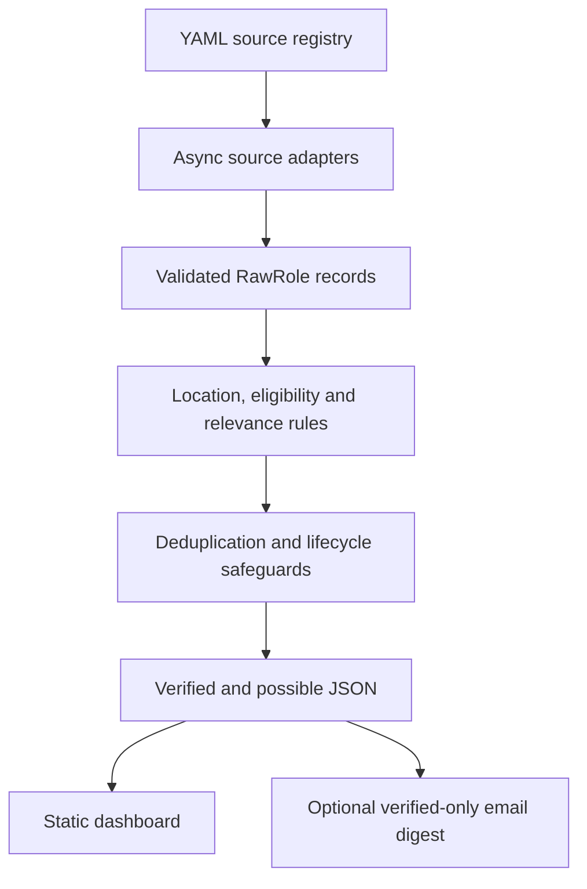

# London 2027 Opportunity Radar

London Opportunity Radar is a breadth-first job discovery pipeline for London internships,
vacation schemes and other plausibly accessible early-career roles. It gathers public vacancy
data, converts different websites into one validated format, applies explainable eligibility and
relevance rules, removes duplicates, and publishes an automatically updated static dashboard.

The target candidate is a penultimate-year, non-law undergraduate graduating in 2028. The system
does not infer specialist STEM, software or quantitative eligibility from general technical
experience, and employer prestige never overrides an explicit eligibility restriction.

The project favours recall over perfect recommendations: a candidate should see a plausible role
and decide whether to apply. To avoid presenting uncertainty as fact, results are separated into
two evidence tiers:

- **Verified**: the source and wording provide enough evidence for the configured candidate,
  location and role-relevance rules.
- **Possible - check criteria**: the role appears plausibly accessible, but important eligibility
  wording is missing or comes from a discovery board. The candidate must check the linked listing.

## Current snapshot

The checked-in data was captured on 12 August 2026. It is a reproducible snapshot, not a guarantee
that every linked role remains open. 

Live link: https://williamtdavies.github.io/broad-london-opportunity-radar/ 

| Measure | Snapshot |
| --- | ---: |
| Listing appearances scanned | 7,359 |
| Verified roles | 16 |
| Possible roles | 982 |
| Employers represented in displayed roles | 570 |
| Role-producing source configurations | 15 |
| Additional official pages watched for changes | 18 |

This 12 August 2026 snapshot adds 1,475 unique DWP Work Hub records from 4,182 result
appearances across 30 query shards, 86 Prospects cards and the current Legal Cheek noticeboard.
Adzuna and Reed are included in the 15 configured role producers but are visibly inactive in this
snapshot because external API credentials were not available; they contribute zero to the numbers
above until their GitHub secrets are supplied.

The dashboard includes the Carlyle Private Credit Intern as a possible role. Its official Workday
description establishes a London internship but does not state the required study or graduation
year, so the system correctly avoids labelling eligibility as verified.

No scraper can guarantee every vacancy on the web. LinkedIn, Indeed, Glassdoor and Google Jobs are
not directly scraped, and the project does not bypass authentication, CAPTCHAs, robots restrictions
or other access controls. Coverage and source failures are exposed rather than hidden.

## Architecture



The application is deliberately small. Python performs collection, validation, classification and
site generation. The published site is plain HTML, CSS and JavaScript, so GitHub Pages can host it
without a continuously running application server.

## How data is gathered

### 1. Source registry

`config/employers.yml` defines each configured source: its endpoint, adapter, authority, location
scope, rate limit, polling interval and review policy. A configured employer is a monitoring target,
not a whitelist. Broad job boards can discover employers that are not individually registered.

`config/trusted_sources.yml` records why a board is trusted or why it is restricted to discovery.
Source authority is part of every role and affects what the system may claim:

- official ATS, employer and government records may support verified publication;
- approved sector boards may establish that a vacancy exists;
- discovery-only boards can contribute only to the possible layer.

### 2. Retrieval and adapters

The scanner uses `asyncio` and HTTPX with bounded concurrency, host-level rate limiting, timeouts,
retries with backoff, a descriptive user agent and robots checks. One source failing does not stop
the rest of the scan.

Each adapter converts its website's JSON, XML or HTML into the same Pydantic `RawRole` model.
Supported adapters include Workday, Greenhouse, Lever, Ashby, SmartRecruiters, Teamtailor, generic
JSON, RSS/Atom, monitored HTML and specialised public-board parsers.

The broad-board adapters follow available results pages or a configured query matrix and compare
the number parsed with advertised totals where the source exposes them. A mismatch, result cap or
parser failure degrades source health and prevents a bad scan from silently erasing unseen earlier
results. A listing that is fetched and now fails the filter is removed immediately. Workday search
results are enriched from the official detail endpoint because the search response alone usually
lacks eligibility evidence.

### 3. Enabled role-producing sources

| Source | Authority | Latest captured listings | Behaviour |
| --- | --- | ---: | --- |
| CharityJob London | Discovery only | 1,235 | All 83 result pages |
| NHS Jobs London | Official government portal | 1,106 | All 12 result pages |
| jobs.ac.uk London | Discovery only | 433 | All 18 result pages |
| W4MP Jobs | Trusted sector board | 151 | All 8 result pages |
| targetjobs London early careers | Discovery only | 79 | Public search service, advertised count checked |
| Higherin London internships | Discovery only | 69 | All 4 result pages |
| Blackstone | Curated official ATS records | 11 | Official snapshot, requires re-verification |
| Bank of America | Curated official ATS records | 3 | Official snapshot, requires re-verification |
| BlackRock | Curated official ATS records | 2 | Official snapshot, requires re-verification |
| Carlyle | Official Workday ATS | 1 | Search plus role-detail enrichment |
| DWP Find a Job / Work Hub | Official government portal | Live query-matrix capture | 30 configurable London search shards with ID deduplication |
| Prospects London | Discovery only | Live browse-page capture | All public London cards, including work experience |
| Legal Cheek Hub | Discovery only | Live noticeboard capture | Law work experience, vacation schemes, open days and jobs |
| Adzuna | Discovery only | Inactive until keys are added | Documented API; 30 query shards and overlap deduplication |
| Reed | Discovery only | Inactive until a key is added | Documented Jobseeker API; 30 query shards and overlap deduplication |

The adapter registry supports more platforms than are currently enabled. A supported parser is not
the same as live coverage of every employer using that platform. Employer-specific endpoints must
be verified and fixture-tested before they are enabled.

The optional API-key steps and exact one-source commands are in
[`BROAD_SOURCE_SETUP.md`](BROAD_SOURCE_SETUP.md). The public dashboard and all nine no-login broad
sources work without Supabase, Resend, Adzuna or Reed credentials.

### 4. Deterministic classification

The project does not use an LLM or opaque recommendation model. It applies auditable YAML rules and
Python logic to:

- normalise London, remote-UK and approved UK-wide locations;
- identify programme type and whether the 2027 cycle is actually stated;
- assess study year, graduation year, degree restrictions and non-law vacation-scheme rules;
- preserve citizenship, nationality, residency and security-clearance requirements without
  treating one as proof of another;
- classify the role into an explainable category;
- assess substantive relevance separately from eligibility; and
- calculate a component score from eligibility, relevance, skills, organisation quality,
  geography, recency, deadline urgency and source quality.

Every decision retains rule IDs, source URLs and evidence fragments. Explicitly unsuitable,
out-of-scope, unpaid or closed roles are not made public. Incomplete but plausible roles may enter
the possible layer.

### 5. Deduplication and lifecycle

Records are matched using source identifiers, canonical application URLs, ATS requisition IDs and
normalised employer-title-location keys. If the same role appears on multiple sites, the stronger
official source is preferred while all known source URLs are retained.

A role is not closed merely because one scan misses it. Automatic closure requires absence from
three consecutive healthy, uncapped scans. Failed, capped or structurally changed sources retain
their previous possible roles until a trustworthy scan succeeds.

### 6. Persistence and publication

Validated state is written atomically to `data/*.json`. The site builder then generates
`site/generated/`, including separate `roles.json` and `possible-roles.json` files. The browser
performs search, filtering, sorting and saved-role handling locally; saved roles remain in
`localStorage` and are not uploaded.

GitHub Actions schedules a whole-registry scan every 30 minutes. The four largest rate-limited feeds
are polled at most every six hours during scheduled scans. If semantic data changes, the workflow
commits the JSON and the Pages workflow rebuilds the same public URL.

## Technology

| Area | Technology | Purpose |
| --- | --- | --- |
| Runtime | Python 3.12 | Collection, classification and site generation |
| HTTP | HTTPX, `asyncio` | Concurrent public-source requests and failure isolation |
| Validation | Pydantic | Strict source-neutral role and configuration models |
| Configuration | PyYAML | Human-readable source and classification rules |
| Dashboard | HTML, CSS, vanilla JavaScript | Static filtering, sorting, details and saved roles |
| Automation | GitHub Actions | CI, scheduled scans and Pages deployment |
| Optional email | Supabase and Resend | Double opt-in subscriptions and verified-only digests |
| Quality | Pytest, Ruff, mypy, Node test runner | Tests, formatting, linting and type checking |

## Repository map

```text
config/                         Source registries and classification rules
data/                           Checked-in validated role and health state
fixtures/                       Saved test responses; never production roles
site/templates/                 Dashboard HTML template
site/static/                    Dashboard CSS and JavaScript
src/opportunity_radar/adapters/ Retrieval and source-specific parsers
src/opportunity_radar/classification/ Eligibility, relevance and possible-role rules
src/opportunity_radar/pipeline/ Scanning, deduplication, change and closure logic
src/opportunity_radar/site/     Static-site builder
src/opportunity_radar/email/    Optional digest implementation
supabase/                       Optional subscription schema and Edge Functions
tests/                          Python and JavaScript regression tests
.github/workflows/              CI, scan, Pages and optional digest automation
```

## Local setup

Use Python 3.12 for the pinned environment. The pinned Pydantic build used by this repository is not
compatible with Python 3.14.

### Windows

```powershell
py -3.12 -m venv .venv
.venv\Scripts\activate
python -m pip install --upgrade pip
python -m pip install -e ".[dev]"
```

### macOS or Linux

```bash
python3.12 -m venv .venv
source .venv/bin/activate
python -m pip install --upgrade pip
python -m pip install -e ".[dev]"
```

Run the isolated fixture pipeline and preview the generated test site:

```bash
python run.py scan --fixtures
python run.py validate --fixtures
python run.py build-site --fixtures
python -m http.server 8000 --directory build/fixture-site
```

Open `http://localhost:8000`. Fixture roles use saved test data and `example.invalid` URLs; they are
never published as real opportunities.

To run a live scan and preview the production dataset locally:

```bash
python run.py scan
python run.py validate
python run.py build-site
python -m http.server 8000 --directory site/generated
```

Live scans can take several minutes because public sources are deliberately rate-limited.

## Useful commands

```bash
python run.py scan
python run.py scan --source carlyle
python run.py scan --category public-policy-and-policy-research
python run.py scan --fixtures
python run.py classify --role-id ROLE_ID
python run.py explain --role-id ROLE_ID
python run.py review-queue
python run.py approve --role-id ROLE_ID --reason "Official evidence reviewed" \
  --evidence-url https://official.example/role
python run.py build-site
python run.py validate
python run.py source-health
python run.py digest --dry-run --fixtures
```

Commands return non-zero for invalid configuration, missing records, unsafe approvals or build
failures. Logs identify sources and errors but do not print secret values.

## Changing what appears

Do not edit generated JSON or `site/generated/` by hand; the next scan or build will replace it.

| Goal | Primary file |
| --- | --- |
| Enable, disable or configure a source | `config/employers.yml` |
| Add finance, consulting, law or other search phrases | `broad_search_queries` in `config/employers.yml` |
| Document trusted and discovery boards | `config/trusted_sources.yml` |
| Change categories and category keywords | `config/categories.yml` |
| Change verified study-stage eligibility phrases | `config/eligibility_rules.yml` |
| Change hard exclusions or broad title inclusions/exclusions | `config/job_filters.yml` |
| Change relevance vocabulary and score weights | `config/relevance_rules.yml` |
| Correct one role using official evidence | `config/manual_overrides.yml` |
| Change browser filters or sorting | `site/static/app.js` and `site/templates/index.html` |
| Add or repair an employer/board scraper | `src/opportunity_radar/adapters/parsers.py` |
| Repair DWP, Prospects, Legal Cheek, Adzuna or Reed | `src/opportunity_radar/adapters/broad_sources.py` |

Receptionist, nursery/early-years, heavy quant, required-C++, kitchen/catering, generic retail
sales, locum and other obvious specialist-service false positives are explicitly excluded. Broad
words such as `assistant`, `analyst` and
`operations` remain accepted because removing them would hide many relevant junior roles. Add a
specific exclusion and a regression test when a new repeated false-positive title appears.

After changing sources or classification rules, run:

```bash
ruff format --check .
ruff check .
mypy
pytest
python run.py scan --fixtures
python run.py validate --fixtures
node --test tests/js/*.test.*
```

## GitHub Pages deployment

The public dashboard and the no-login source set do **not** require Supabase, Resend or an API key.
Adzuna and Reed are optional extra sources; see `BROAD_SOURCE_SETUP.md` for their GitHub secrets.

1. Push the repository to GitHub.
2. In **Settings > Pages**, choose **GitHub Actions** as the source.
3. In **Settings > Actions > General**, allow Actions and give workflows read/write repository
   permission so the scheduled scanner can commit changed `data/` files.
4. Run the `CI` workflow.
5. Run `Deploy GitHub Pages` once. GitHub will show the permanent Pages URL.
6. Run `Scan sources` manually once if you want an immediate refresh. Afterwards it runs on its
   schedule, and data changes trigger a rebuild at the same URL.

Without an email endpoint, the generated dashboard remains fully usable and displays the email form
as unavailable. The scheduled `Daily digest` workflow should be disabled in the GitHub Actions UI if
email alerts are not being deployed; otherwise its scheduled production run will lack the required
secrets and fail.

## Optional email alerts

The `supabase/` directory is optional infrastructure for public email subscriptions. It contains the
RLS-protected database migration and the subscribe, confirm and unsubscribe Edge Functions. Resend
delivers confirmation messages and verified-only digests.

You do not need a Supabase account to scan jobs, build the dashboard or deploy GitHub Pages. Leaving
the directory in the repository does not install Supabase, create a project, expose a key or incur a
charge.

If email alerts are required:

1. Create a Supabase project and apply
   `supabase/migrations/202608100001_subscribers.sql`.
2. Set Edge Function secrets: `SUPABASE_URL`, `SUPABASE_SERVICE_ROLE_KEY`, `RESEND_API_KEY`,
   `RESEND_FROM_EMAIL`, `ALLOWED_ORIGIN` and a random `TOKEN_SECRET` of at least 32 bytes.
3. Deploy `subscribe`, `confirm` and `unsubscribe` with `--no-verify-jwt`; the functions implement
   their own origin and token controls.
4. Verify the sending domain in Resend.
5. Add the corresponding GitHub Actions secrets and set repository variables `SITE_URL`,
   `ALLOWED_ORIGIN` and `SUBSCRIBE_ENDPOINT`.
6. Test subscribe, confirmation, digest delivery and unsubscribe with one address before enabling
   the scheduled digest.

Do not expose the Supabase service-role key or `TOKEN_SECRET` in browser code, generated HTML or a
GitHub repository variable.

### Can `supabase/` be deleted?

Not by itself. The scraper and dashboard do not need the directory, but the current repository still
contains an optional email subsystem that depends on it. Deleting only `supabase/` would break its
security tests and leave dead references in the dashboard, CLI, digest workflow and documentation.

For a dashboard-only fork, the safest choice is to keep the unused directory and disable the
`Daily digest` workflow. A complete removal must also remove the email package, digest CLI command,
subscription form and JavaScript, digest workflow, related tests, `digest_state.json` handling and
email-specific documentation and validation rules as one tested change.

## Quality and safety

```bash
ruff format --check .
ruff check .
mypy
pytest
python run.py scan --fixtures
python run.py validate --fixtures
node --test tests/js/*.test.*
```

Tests use mocks and saved fixtures; they do not contact employers or send email. CI validates YAML,
workflows, public-data boundaries, fixture end-to-end behaviour and repository hygiene.

Source content is treated as untrusted data. It is validated and escaped before appearing in HTML
or email. Subscriber data, when the optional system is deployed, stays in Supabase and never enters
the repository or public JSON.

## Known limitations

- Most seeded employers remain disabled until a stable public endpoint and regression fixture are
  verified. Their presence in the registry does not mean their vacancies are being scraped.
- Official curated records for Bank of America, BlackRock and Blackstone require scheduled manual
  re-verification for changed wording, closure and newly added divisions.
- Workday and other proprietary ATS installations often need tenant-specific endpoints or request
  bodies. Support for one tenant does not automatically cover every tenant.
- Discovery-board summaries often omit study-stage and right-to-work requirements. Those records
  remain possible rather than verified.
- Rules cannot interpret every unusual vacancy. Important uncertain cases remain visible for human
  review, and users must verify the original application page.
- Source-health success proves that configured pages were retrieved and parsed; it does not prove
  that every division, employer or vacancy site on the internet was covered.

More detail is available in [ARCHITECTURE.md](ARCHITECTURE.md), [SOURCES.md](SOURCES.md),
[METHODOLOGY.md](METHODOLOGY.md), [AUDIT.md](AUDIT.md), [PRIVACY.md](PRIVACY.md),
[SECURITY.md](SECURITY.md) and [CONTRIBUTING.md](CONTRIBUTING.md).

## Licence

MIT. Employer names and job descriptions remain the property of their respective owners. This
project stores short evidence excerpts and links to source listings.
